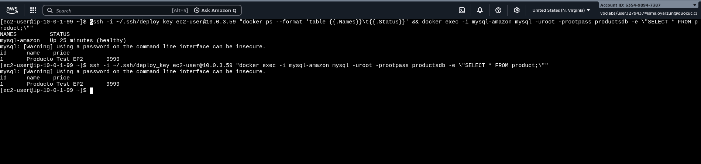
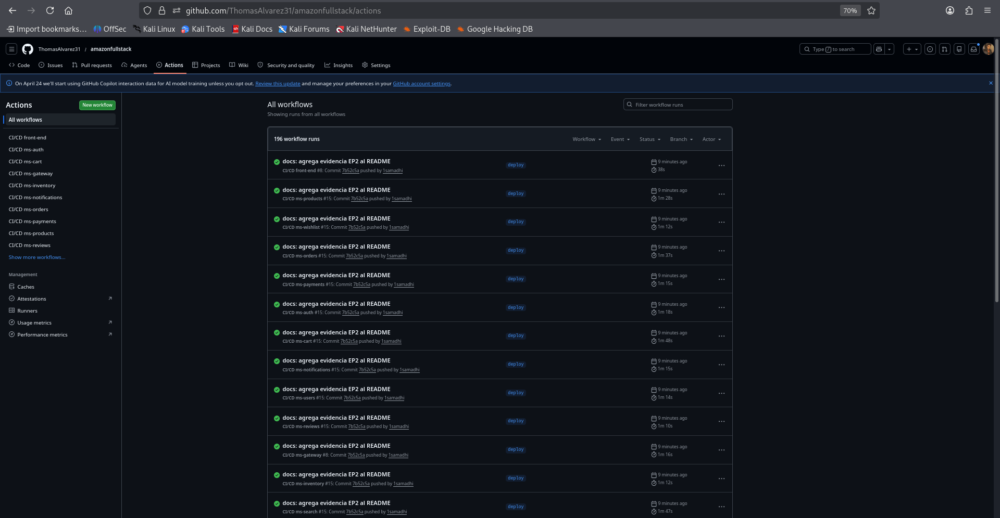
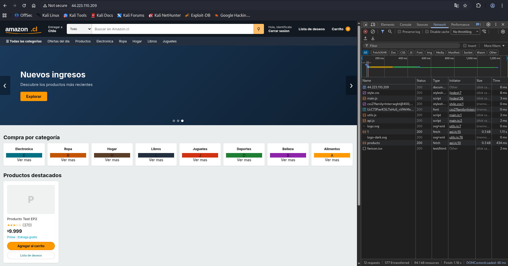
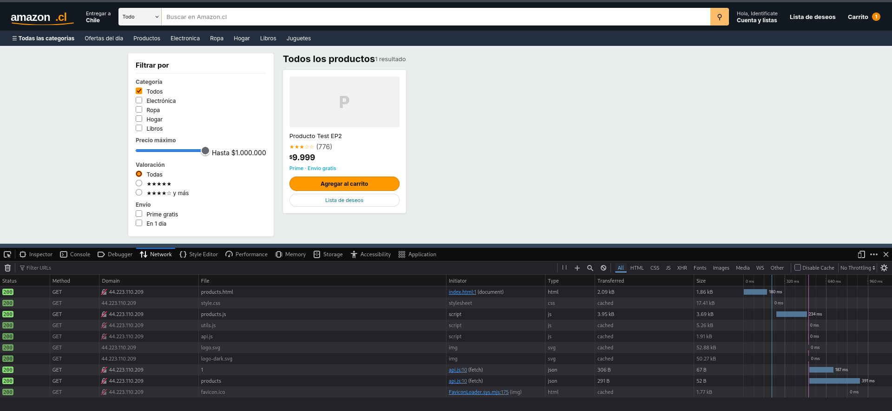

# Amazon Fullstack — E-Commerce con Microservicios

Aplicación de e-commerce desplegada con arquitectura de microservicios en AWS EC2, usando Java Spring Boot, MySQL 8, Docker y CI/CD con GitHub Actions.

---

## Arquitectura en AWS

```
Internet
    │
    ▼
┌─────────────────────────────────────────────────────┐
│  VPC us-east-1  (vpc-0058f1845022237d0)             │
│                                                     │
│  ┌──────────────────────────────────────────────┐   │
│  │  Subnet Pública                              │   │
│  │  ec2-web (98.82.167.73)                      │   │
│  │  ├── ms-gateway  :8080                       │   │
│  │  └── front-end   :80   ← accesible desde web │   │
│  └──────────────┬───────────────────────────────┘   │
│                 │ SG-App (8080-8092)                 │
│  ┌──────────────▼───────────────────────────────┐   │
│  │  Subnet Privada App1 (10.0.1.209)            │   │
│  │  ec2-app-1                                   │   │
│  │  ├── ms-auth        :9000                    │   │
│  │  ├── ms-users       :8082                    │   │
│  │  ├── ms-products    :8085                    │   │
│  │  ├── ms-cart        :8087                    │   │
│  │  ├── ms-wishlist    :8092                    │   │
│  │  └── ms-search      :8091                    │   │
│  └──────────────┬───────────────────────────────┘   │
│                 │                                    │
│  ┌──────────────▼───────────────────────────────┐   │
│  │  Subnet Privada App2 (10.0.4.96)             │   │
│  │  ec2-app-2                                   │   │
│  │  ├── ms-orders       :8084                   │   │
│  │  ├── ms-payments     :8086                   │   │
│  │  ├── ms-shipping     :8088                   │   │
│  │  ├── ms-inventory    :8083                   │   │
│  │  ├── ms-reviews      :8090                   │   │
│  │  ├── ms-notifications:8089                   │   │
│  │  ├── kafka           :9092                   │   │
│  │  └── zookeeper       :2181                   │   │
│  └──────────────┬───────────────────────────────┘   │
│                 │ SG-Data (3306)                     │
│  ┌──────────────▼───────────────────────────────┐   │
│  │  Subnet Privada Data (10.0.3.59)             │   │
│  │  ec2-data                                    │   │
│  │  └── MySQL 8  :3306  (volumen persistente)   │   │
│  └──────────────────────────────────────────────┘   │
└─────────────────────────────────────────────────────┘
```

Solo el frontend (`ec2-web:80`) es accesible desde Internet. El resto de servicios están en subredes privadas, accesibles únicamente a través del gateway o entre EC2 según los Security Groups.

---

## Microservicios

| Servicio           | Puerto | EC2       | Descripción                     |
|--------------------|--------|-----------|---------------------------------|
| ms-gateway         | 8080   | ec2-web   | API Gateway — punto de entrada  |
| front-end          | 80     | ec2-web   | Frontend React + Vite sobre nginx |
| ms-auth            | 9000   | ec2-app-1 | Autenticación y JWT             |
| ms-users           | 8082   | ec2-app-1 | Gestión de usuarios             |
| ms-products        | 8085   | ec2-app-1 | Catálogo de productos           |
| ms-cart            | 8087   | ec2-app-1 | Carrito de compras              |
| ms-wishlist        | 8092   | ec2-app-1 | Lista de deseos                 |
| ms-search          | 8091   | ec2-app-1 | Búsqueda de productos           |
| ms-orders          | 8084   | ec2-app-2 | Gestión de pedidos              |
| ms-payments        | 8086   | ec2-app-2 | Procesamiento de pagos          |
| ms-shipping        | 8088   | ec2-app-2 | Envíos y despacho               |
| ms-inventory       | 8083   | ec2-app-2 | Control de inventario           |
| ms-reviews         | 8090   | ec2-app-2 | Reseñas de productos            |
| ms-notifications   | 8089   | ec2-app-2 | Notificaciones vía Kafka        |

---

## Stack Tecnológico

- **Backend:** Java 17, Spring Boot 3.2.5, Spring Cloud Gateway, Spring Data JPA
- **Base de datos:** MySQL 8 (migración desde H2 para producción)
- **Mensajería:** Apache Kafka + Zookeeper
- **Frontend:** React 18, Vite, TypeScript, nginx (proxy inverso al gateway)
- **Contenedores:** Docker (multi-stage build, usuario no-root), Docker Compose
- **Registro de imágenes:** AWS ECR (13 repositorios)
- **CI/CD:** GitHub Actions (14 workflows)
- **Infraestructura:** AWS VPC, 4x EC2 t3.micro, Security Groups, NAT Gateway

---

## Frontend (React + Vite)

El frontend del proyecto se construye como una SPA con React 18 + Vite + TypeScript.

### Componentes principales

- `front-end/src/`: codigo fuente React (rutas, vistas y cliente API)
- `front-end/index.html`: entrada unica de la SPA (`#root`)
- `front-end/vite.config.ts`: servidor de desarrollo y proxy de `/api`
- `front-end/nginx.conf`: fallback SPA y proxy al gateway en produccion

### Integracion con backend

- En desarrollo, Vite corre en `:5173` y redirige `/api/*` a `http://localhost:8080`.
- En produccion, Nginx sirve el build estatico y reenvia `/api/*` a `ms-gateway:8080`.

### Flujo de build y runtime

1. `npm run build` genera `front-end/dist/`.
2. El `Dockerfile` de frontend construye con Node y publica con Nginx.
3. El contenedor final expone `8080` y entrega la SPA ya compilada.

### Comandos utiles (frontend)

```bash
cd front-end
npm install
npm run dev
npm run build
npm run preview
```

---

## Contenedorización

### Dockerfiles

Cada microservicio y el frontend tienen su propio `Dockerfile` con **multi-stage build**:

```dockerfile
# Stage 1 — build (imagen Maven completa)
FROM maven:3.9-eclipse-temurin-17 AS builder
WORKDIR /app
COPY pom.xml .
RUN mvn dependency:go-offline
COPY src ./src
RUN mvn clean package -DskipTests

# Stage 2 — runtime (imagen mínima)
FROM eclipse-temurin:17-jre-alpine
RUN addgroup -S appgroup && adduser -S appuser -G appgroup
WORKDIR /app
COPY --from=builder /app/target/*.jar app.jar
USER appuser          # usuario no-root
EXPOSE <puerto>
ENTRYPOINT ["java", "-jar", "app.jar"]
```

El frontend usa una imagen final `nginx` no-root para servir el build estatico generado por Vite.

**Buenas prácticas aplicadas:**
- Multi-stage: la imagen final no contiene Maven ni código fuente
- Usuario no-root: reduce superficie de ataque
- `dependency:go-offline` separado del build: mejor cache de capas

### Persistencia de datos

Se usan **named volumes** (no bind mounts) para MySQL:

```yaml
volumes:
  mysql_data:   # named volume gestionado por Docker
```

**Razón:** Los named volumes persisten al reiniciar o recrear el contenedor, son portables y no dependen de la estructura de directorios del host. Si se usara bind mount, una ruta incorrecta en EC2 impediría iniciar el servicio.

---

## Docker Compose

El stack está dividido por EC2 para despliegue independiente:

| Archivo                   | EC2       | Servicios                                    |
|---------------------------|-----------|----------------------------------------------|
| `docker-compose.yml`      | Local     | Stack completo para desarrollo               |
| `docker-compose.data.yml` | ec2-data  | MySQL 8 con volumen persistente              |
| `docker-compose.app1.yml` | ec2-app-1 | ms-auth, users, products, cart, wishlist, search |
| `docker-compose.app2.yml` | ec2-app-2 | ms-orders, payments, shipping, inventory, reviews, notifications, kafka |
| `docker-compose.web.yml`  | ec2-web   | ms-gateway + front-end nginx                 |

### Levantar en local (desarrollo)

```bash
docker-compose up --build
```

Acceder al frontend en `http://localhost:80` y a la API en `http://localhost:8080`.

### Levantar en AWS (por EC2)

```bash
# ec2-data
docker compose -f docker-compose.data.yml --env-file .env up -d

# ec2-app-1
docker compose -f docker-compose.app1.yml --env-file .env up -d

# ec2-app-2
docker compose -f docker-compose.app2.yml --env-file .env up -d

# ec2-web
docker compose -f docker-compose.web.yml --env-file .env up -d
```

---

## Pipeline CI/CD

### Flujo completo

```
push → rama deploy
        │
        ▼
   GitHub Actions
        │
   1. Checkout del código
   2. Configurar credenciales AWS
   3. Login en ECR
   4. docker build (multi-stage)
   5. docker push → ECR
        │
   6. SSH a EC2 (vía bastion ec2-web)
   7. docker pull imagen nueva
   8. docker compose up -d --no-deps <servicio>
```

Cada microservicio tiene su propio workflow en `.github/workflows/` con **path filter** — solo se ejecuta si hay cambios en los archivos de ese microservicio.

### Activación

Los workflows se activan con `push` en la rama **`deploy`**:

```yaml
on:
  push:
    branches: [deploy]
    paths:
      - 'ms-auth/**'
      - '.github/workflows/ms-auth.yml'
```

### Verificacion post-deploy

Cada workflow valida que el contenedor desplegado quede efectivamente en ejecucion despues del `docker compose up -d --no-deps`.

Comando de validacion usado:

```bash
docker inspect -f '{{.State.Running}}' <servicio> | grep -q true
```

Si el contenedor no queda en estado running, el job falla y el despliegue se considera no exitoso.

### Secrets configurados en GitHub

| Secret                | Descripción                          |
|-----------------------|--------------------------------------|
| `AWS_ACCESS_KEY_ID`   | Credencial AWS Academy               |
| `AWS_SECRET_ACCESS_KEY` | Credencial AWS Academy             |
| `AWS_SESSION_TOKEN`   | Token de sesión AWS Academy          |
| `AWS_REGION`          | `us-east-1`                          |
| `AWS_ACCOUNT_ID`      | ID de cuenta AWS                     |
| `EC2_SSH_KEY`         | Clave privada para SSH a las EC2     |
| `EC2_WEB_HOST`        | IP pública de ec2-web (bastion)      |
| `EC2_APP1_HOST`       | IP privada de ec2-app-1              |
| `EC2_APP2_HOST`       | IP privada de ec2-app-2              |
| `EC2_DATA_HOST`       | IP privada de ec2-data               |
| `EC2_SSH_USER`        | `ec2-user`                           |

Las credenciales AWS nunca se almacenan en el código — solo en GitHub Secrets.

### Registro de imágenes: ECR

Se usa **AWS ECR** (Elastic Container Registry) en lugar de Docker Hub porque:
- Las EC2 con `LabInstanceProfile` tienen acceso nativo a ECR sin credenciales adicionales
- Las imágenes quedan en la misma región que las instancias (menor latencia en pull)
- Integración nativa con `aws-actions/amazon-ecr-login`

---

## Estructura del repositorio

```
amazonfullstack/
├── .github/
│   └── workflows/          # 14 workflows CI/CD (uno por servicio)
│       ├── ms-auth.yml
│       ├── ms-cart.yml
│       ├── ms-gateway.yml
│       ├── front-end.yml
│       └── ...
├── mysql/
│   └── init/
│       └── init.sql        # Crea los 12 schemas al iniciar MySQL
├── ms-auth/
│   ├── Dockerfile          # Multi-stage build
│   └── src/...
├── ms-cart/ ...
├── front-end/
│   ├── Dockerfile          # build Vite + nginx unprivileged runtime
│   ├── nginx.conf
│   ├── src/                # app React (TypeScript)
│   ├── css/
│   └── vite.config.ts
├── docker-compose.yml      # Stack completo (desarrollo local)
├── docker-compose.data.yml # Solo MySQL (ec2-data)
├── docker-compose.app1.yml # 6 microservicios (ec2-app-1)
├── docker-compose.app2.yml # 6 microservicios + kafka (ec2-app-2)
└── docker-compose.web.yml  # gateway + frontend (ec2-web)
```

---

## Variables de entorno por EC2

Cada EC2 tiene un archivo `.env` local (no versionado):

```bash
# ec2-data
MYSQL_ROOT_PASSWORD=...

# ec2-app-1 y ec2-app-2
ECR=<account>.dkr.ecr.us-east-1.amazonaws.com
MYSQL_ROOT_PASSWORD=...
DB_HOST=10.0.3.59

# ec2-web
ECR=<account>.dkr.ecr.us-east-1.amazonaws.com
APP1_HOST=10.0.1.209
APP2_HOST=10.0.4.96
```

El gateway usa `${APP1_HOST}` y `${APP2_HOST}` para enrutar peticiones a los microservicios en subredes privadas.

### Plantillas de entorno (sin secrets)

Se incluyen plantillas para documentar variables requeridas sin exponer credenciales:

- `.env.data.example`
- `.env.app1.example`
- `.env.app2.example`
- `.env.web.example`

Uso sugerido en cada instancia EC2:

```bash
cp .env.data.example .env
# editar valores reales antes de levantar contenedores
```

---

## Evidencia EP2

**URL pública frontend:** http://44.223.110.209

### Resultados por indicador

| Indicador | Resultado | Detalle |
|-----------|-----------|---------|
| IE1 — Contenedorización Frontend y Backend (Dockerfile multi-stage) | OK | 14 Dockerfiles multi-stage en `front-end/Dockerfile` y `ms-*/Dockerfile` |
| IE2 — Configuración docker-compose.yml | OK | Stack dividido por responsabilidad: `docker-compose.web.yml`, `docker-compose.app1.yml`, `docker-compose.app2.yml`, `docker-compose.data.yml` |
| IE3 — Persistencia con volúmenes Docker | OK | Dato persiste tras `docker restart mysql-amazon` |
| IE4 — Pipeline CI/CD (build → push → deploy) | OK | GitHub Actions ejecuta build, push a ECR y deploy en EC2 al hacer push en rama `deploy` |
| IE5 — Frontend en EC2 público | OK | Frontend carga en `http://44.223.110.209`, nginx responde HTTP 200 |
| IE6 — Backend en EC2 | OK | Todos los contenedores Up en 4 nodos; MySQL healthy con volumen persistente |
| IE7 — Integración Front → Back | OK | Register 201 + JWT, `/api/products` y `/api/users` responden 200 |

### Capturas de evidencia

**IE3 — Persistencia MySQL post-reinicio**


**IE4 — Pipeline CI/CD en GitHub Actions**


**IE5 — Frontend accesible desde navegador**


**IE6 — Contenedores Up en los 4 nodos EC2**


**IE7 — Integración Front → Back**


### Comandos de validación usados

```bash
# IE5 — frontend
curl -I http://localhost:80
docker ps --filter "name=front-end" --format "table {{.Names}}\t{{.Status}}\t{{.Ports}}"

# IE6 — gateway y rutas
curl -i http://localhost:8080/actuator/health
curl -i http://localhost:8080/api/products
curl -i http://localhost:8080/api/users

# IE7 — register vía gateway
curl -i -X POST http://localhost:8080/api/auth/register \
  -H "Content-Type: application/json" \
  -d '{"email":"test.gateway2026@test.com","password":"password123"}'

# IE3 — persistencia
docker exec -i mysql-amazon mysql -uroot -prootpass productsdb \
  -e "INSERT INTO product (name, price) VALUES ('Producto Test EP2', 9999);"
docker restart mysql-amazon
docker exec -i mysql-amazon mysql -uroot -prootpass productsdb \
  -e "SELECT * FROM product;"
```

### Respuestas obtenidas

```
# IE5
HTTP/1.1 200 OK — Server: nginx/1.29.8

# IE6 — actuator
HTTP/1.1 200 OK — {"status":"UP"}

# IE6 — productos
HTTP/1.1 200 OK — [{"id":1,"name":"Producto Test EP2","price":9999.0}]

# IE7 — register
HTTP/1.1 201 Created — {"role":"USER","token":"eyJhbGci..."}

# IE3 — select post restart
id: 1 | name: Producto Test EP2 | price: 9999
```
